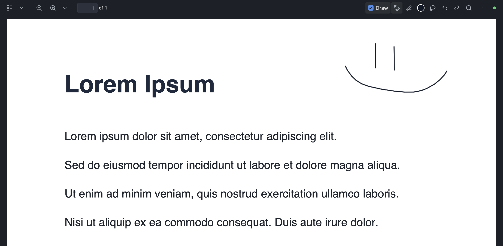

# Welcome to Handwriting Natively!

## What Handwriting Natively Does

Handwrite on PDFs with a stylus or mouse natively in obsidian! Annotations live in vault metadata with the original PDFs untouched. Export the copy for the PDF with the added notes.

I made this plugin after realizing I use Obsidian a lot more than another nameless note taking app.. I hope you find it as useful as I do!



- Pen, graphite pencil, highlighter, laser pointer (fades away, not saved), circular eraser, lasso, and rich-text annotation tools with a compact Draw toolbar
- Draw mode opt-in so normal PDF mouse/trackpad behavior stays intact until you annotate
- Configurable touch navigation: one-finger PDF scrolling or annotation input, plus two-finger pinch zoom and parallel swipe scrolling
- Optional hold-to-straighten: pause at the final stroke point for one second, then release to create a straight line
- Autosave, recovery, and explicit Save; commands for save, export, and select-all ink (`save-active-pdf-annotations`, `export-active-annotated-pdf`, `select-all-pdf-ink`)
- Desktop and mobile PDF adapters without telemetry or hosted services

## Setup

### Quick Start

1. Download the latest [GitHub release](https://github.com/MarsLuay/handwriting-natively/releases) assets (`main.js`, `manifest.json`, `styles.css`).
2. Copy them into `<Vault>/.obsidian/plugins/native-pdf-handwriting/`.
3. Reload Obsidian and enable **Handwriting Natively** under **Settings → Community plugins**.
4. Open a PDF, turn on **Draw**, and annotate.

### Manual Setup

```bash
git clone https://github.com/MarsLuay/handwriting-natively.git
cd handwriting-natively
npm install
npm test
npm run build
```

Copy `manifest.json`, `main.js`, and `styles.css` into your vault plugin folder, then reload Obsidian. See `docs/manual-test-checklist.md` before trusting private PDF-view integration.

Settings includes **Copy all settings** for a local JSON snapshot. The UI is English; annotation files are language-independent.

## License

MIT — see [LICENSE](LICENSE).

## Privacy

Local-only annotation processing. See [PRIVACY.md](PRIVACY.md) and [TERMS.md](TERMS.md). No telemetry or hosted service.
